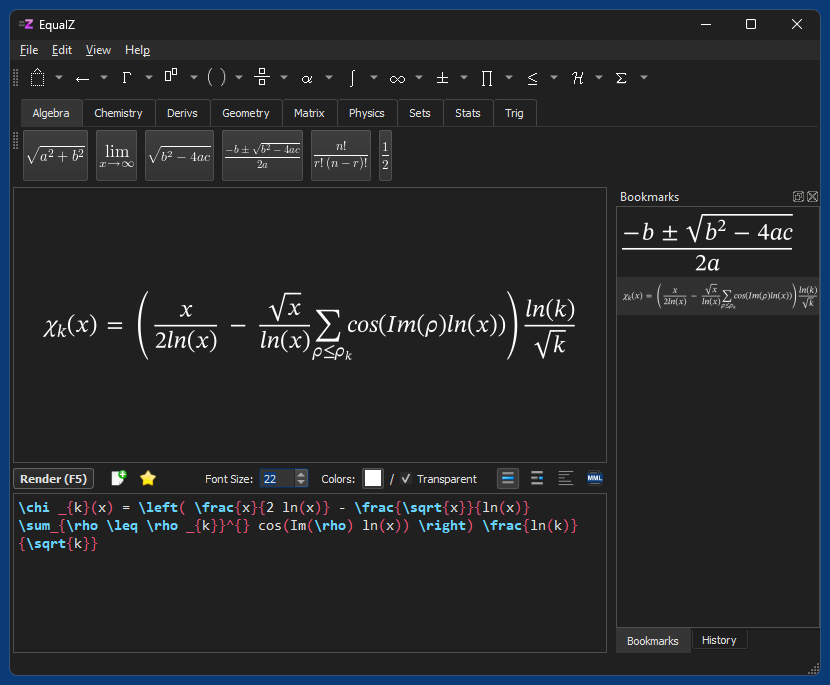

# EqualZ - a simple cross-platform LaTeX Math and MathML equation editor/renderer
EqualZ is a simplified clone of [EqualX](https://equalx.sourceforge.io/), but written in Python and standalone, i.e. without depending on external tools. In other words, you don't have to install a full LaTeX stack and bloat your disk with another 900 MB (as in case of MiKTeX) if you only want to render some simple math equations. 

It instead uses bundled versions of [Ziamath](https://github.com/cdelker/ziamath) to render [LaTeX Math](https://en.wikipedia.org/wiki/LaTeX) and [MathML](https://en.wikipedia.org/wiki/MathML) to SVG and [CairoSVG](https://cairosvg.org/) to convert SVG to other formats. Since no external processes have to be started, equations are also rendered way faster (instantly) than in EqualX.

## Supported export formats
* BMP
* JPEG
* PNG
* PDF
* SVG
* TeX
* TIFF

## Requirements
The frozen [Windows version](https://github.com/59de44955ebd/EqualZ/releases/download/v0.1/EqualZ-windows-x64-setup.exe) has no external dependencies, but the [macOS version](https://github.com/59de44955ebd/EqualZ/releases/download/v0.1/EqualZ-macos.dmg) depends on cairo which you can install via Homebrew:

`brew install cairo`

In [Linux](https://github.com/59de44955ebd/EqualZ/releases/download/v0.1/EqualZ-debian-x64.tar.xz) libcairo is most likely already installed, otherwise run (in Debian/Ubuntu based systems):

`sudo apt install libcairo2`

## Screenshot
*EqualZ in Windows 11*  

## Notes
* To keep the file size and memory consumption of the frozen .exe small, it uses a slightly adjusted local copy of CairoSVG (renamed to "cairosvg_min") that has the dependency on Pillow (which in turn would depend on Numpy) removed - CairoSVG uses Pillow only for a feature that EqualZ doesn't need anyway. But EqualZ works perfectly fine also with the original unaltered version of CairoSVG, just change the import at the top of main.py accordingly.
* The local copy of cairocffi (renamed to "cairocffi_min"), which CairoSVG depends on, only contains a single change that makes sure that the provided small static version of cairo.dll is used, instead of a MSYS2/mingw64 .dll called libcairo-2.dll (with lots of external dependencies) if you have the mingw64 bin directory in the system path (like me). This is again only to make the frozen app smaller and totally optional.
* The portable version for Windows saves bookmarks and history in a local folder called `data`, whereas the installer version creates and uses the folder `C:\Users\<Username>\.equalz`.  
The app detects at runtime if it runs in portable or installer mode by looking for a file called "portable" next to the .exe.

## ToDo
* Add syntax highlighting for MathML
